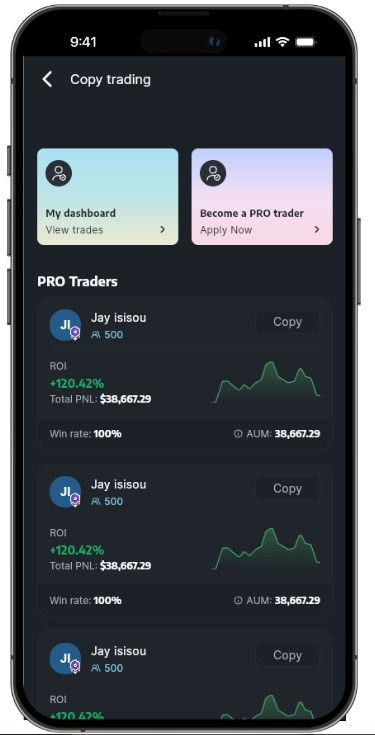

# Crypto App

A Flutter application for cryptocurrency tracking and management.

## App Preview

## Features
- View cryptocurrency prices
- Track portfolio performance
- Real-time market data

## Getting Started

1. Clone the repository
2. Run `flutter pub get` to install dependencies
3. Run `flutter run` to start the app

## Requirements
- Flutter SDK
- Android Studio / Xcode (for mobile development)
- VS Code (optional, for development)
